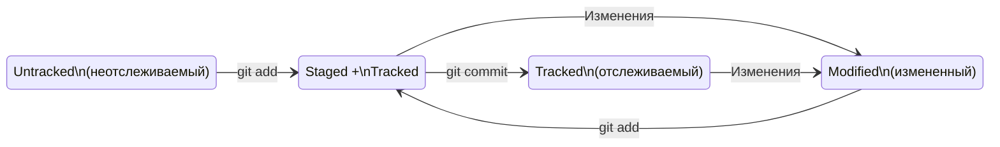

**Добро пожаловать в мини инструкцию по Git**
В данной инструкции будут затронуты темы по работе с **Git** с момента его установки до связывания его с удаленным репозиторием на **github**
# Установка Git
Установка Git может выглядеть по разному в зависимости от ОС (операционная система).
## Установка в Windows
1. Зайти на [сайт](https://git-scm.com/downloads)
2. Скачать установщик
3. Установить

## Установка в Linux
Установка отличается от установки в **Windows**. В зависимости от дистрибутива установка отличается и в самих линукс системах, так на [официальном сайте ](https://git-scm.com/download/linux) предложены варианты установки для наиболее популярных дистрибутивов. 

В общем случае все сводится к установке средствами пакетного менеджера дистрибутива.
**Установка**
1. Открыть терминал
2. Ввести команду представленную на [официальном сайте ](https://git-scm.com/download/linux) в зависимости от дистрибутива
3. Если дистрибутива нет в списке, посмотреть вики дистрибутива
## Установка в macOS
Установить с помощью home brew командой
```bash
brew install git
```
Остальные варианты установки предложены на [сайте](https://git-scm.com/download/mac) git


# Работа с git
Работа с git в основном одинаковая для всех ОС, исключая **Windows**, в которой необходимо использовать **git bash**, в остальных системах работу можно осуществлять с **терминала**. Также работать можно с программами которые предоставляют графический интерфейс для работы с Git.
## Начало работы с Git 
1. Создать папку в которой будет осуществляться контроль версий
```bash
mkdir <Directory name>
```
	1. Создать папку можно в файловом менеджере(проводнике)
	2. <Direcory name> - имя папки по своему выбору без <>
	3. Если есть пробелы то название ввести в "Название"
1. Ввести команду 
```bash
git init
```
Данная команда создаст папку .git внутри родительской папки чтобы контролировать изменения.
3. Произвести изменения в папке
	1. Добавить/удалить файл
	2. Внести изменения в существующие файлы
	3. Добавить/удалить папки
4. Проверить статус изменений
```bash
git status
```
5. Добавить изменения 
```bash
git add . #добавить все файлы которые были изменены
git add filename  #добавить определенный файл который был изменен
git add --all  #добавить все файлы которые были изменены
```
6. Сделать снимок изменений
```bash
git commit -m 'Some message about added change'
```

# Связывание с удаленным репозиторием Github
## Регистрация в github
1. Перейти на [сайт](https://github.com)
2. Зарегистрироваться любым удобным способом
## Создание репозитория
1. Нажать на иконку аватара в Github
2. Выбрать пункт репозитории
3. Создать репозиторий, нажав на кнопку **New**\
4. Выбрать имя для репозитория
5. Выбрать параметры доступности репозитория
6. На свое усмотрение выбрать создание **README** файла (можно не выбирать)
## Связывание github с локальным git репозиторием
1. После создания удаленного репозитория можно выбрать как к нему подключаться, с помощью https или ssh
	1. https будет требовать ввода пароля каждый раз
	2. ssh требует создания ключа по которому будет производится подключение
2. Создание ключа ssh
```bash
ssh-keygen -t ed25519 -C "your@email.com"
```
	1. При выполнении команды создасться 2 ключа публичный и приватный. Важно никому не передавать приватный ключ
3. Внести в github публичный ключ
```bash
cat ~/.ssh/id_ed25519.pub #Скопировать результат выполнения команды
```
	1. В github по нажатию на аватарку выбирать пункт Settings(настройки)
	2. Переходим в раздел SSH keys and GPG keys
	3. New ssh key
	4. Вставить скопированный публичный ключ и добавить его
4. Привязать локальный репозиторий к удаленному
```bash
cd ~/dev/your-project 
git remote add origin git@github.com:account-name/project-name.git
```
	1. строку git@github.com:account-name/project-name.git нужно скопировать из созданного репозитория github 
1. Убедиться что репозитории связаны
```bash
git remote -v 
origin git@github.com:account-name/project-name.git (fetch) 
origin git@github.com:account-name/project-name.git (push)
```
6. Проверить работоспособность
```bash
ssh -T git@github.com                            
The authenticity of host 'github.com (140.82.121.3)' can't be established.
ED25519 key fingerprint is SHA256:+DiY3wvvV6TuJJhbpZisF/zLDA0zPMSvHdkr4UvCOqU.
This key is not known by any other names.
Are you sure you want to continue connecting (yes/no/[fingerprint])? yes
Warning: Permanently added 'github.com' (ED25519) to the list of known hosts.
Hi Acconut name! You've successfully authenticated, but GitHub does not provide shell access.
```
Если вывод будет подобного вида, то это означает что все работает
7. Отправить содержимое локального репозитория на удаленный
	1. При первой отправке необходимо ввести команду
```bash
git push -u origin main # Если команда приведёт к ошибке, попробуйте 
# заменить main на master.
```
8. Последующие изменения можно отправлять используя **git push**

# Хеш, логи и HEAD в Git

## Хеш

В процессе работы часто встречается понятие **хеш коммита**. Хеш в себе хранит уникальную информацию о том:
1. Когда был сделан коммит
2. Содержимое файлов в репозитории на момент коммита
3. Ссылка на предыдущий или родительский (англ. parent) коммит

>Git хеширует (преобразует) информацию о коммите с помощью алгоритма **SHA-1** (от англ. _**S**ecure **H**ash **A**lgorithm_ — «безопасный алгоритм хеширования») и получает для каждого коммита свой уникальный **хеш** — результат хеширования.

**Справочная информация**
1. Таблица соответствия **хеш → информация о коммите** хранится в папке .git
2. Основной идентификатор коммита — это его хеш
3. Если посчитать хеш одного и того же файла (одним и тем же алгоритмом) на двух разных компьютерах, то результат будет гарантированно одинаковым

## Лог Git

Само название отсылает к английскому языку (англ. log - журнал "записей")
Чтобы посмотреть лог изменений Git используется команда **git log**

**Вывод команды git log наглядно**

```bash
git log
commit 926b6cd86ed614006cbf6b955d2424683bf492ad (HEAD -> main, origin/main)
Author: root <guts@fake.com>
Date:   Mon Aug 5 15:24:24 2024 +0300

    Add README file

commit 593413c29d8292a5b31a7e580c3255392405f68b
Author: root <guts@fake.com>
Date:   Mon Aug 5 14:50:24 2024 +0300

    Homework on Yandex Practicum

commit aff31b980be29f18e2e19a3402904ac45840bae9
Author: root <guts@fake.com>
Date:   Sat Aug 3 00:22:16 2024 +0300

    Change todo list

commit cf5c2eb3d20a17361ebdec443dd0348e448f8600
Author: root <guts@fake.com>
Date:   Sat Aug 3 00:19:07 2024 +0300

    Add some string on readme file

commit 626a5da610f1ecadfc8dc2b47183ac0a7af5d261
Author: root <guts@fake.com>
Date:   Sat Aug 3 00:13:11 2024 +0300

    My firs commit on Yandex Practicum

```

**Элементы, из которых состоит описание:**
- строка из цифр и латинских букв после слова **commit** — это хеш коммита;
- **Author** — имя автора и его электронная почта;
- **Date** — дата и время создания коммита;
- в конце находится сообщение коммита.

Получить сокращенный лог можно использовав флаг **--oneline**

```bash
git log --oneline
926b6cd (HEAD -> main, origin/main) Add README file
593413c Homework on Yandex Practicum
aff31b9 Change todo list
cf5c2eb Add some string on readme file
626a5da My firs commit on Yandex Practicum
```

Сокращённый лог полезен, если в репозитории уже много коммитов — например, сотни или тысячи. В этом случае можно быстро найти нужный по описанию.

Сокращённый хеш (то есть первые несколько символов полного) можно использовать точно так же, как и полный. Для этого команда `git log --oneline` автоматически подбирает такую длину сокращённых хешей, чтобы они были уникальными в пределах репозитория и Git всегда мог понять, о каком коммите идёт речь.

**Короткое заключение**
1. Можно вызвать не только полный лог, но и сокращённый — это делается командой `git log --oneline`.
2. В сокращённом логе выводятся сокращённые хеши — их можно использовать точно так же, как и полные.

## HEAD

При вызове команды `git log` вы также могли заметить надпись `(HEAD -> main)` после хеша одного из коммитов.

>Файл `HEAD` (англ. «голова», «головной») — один из служебных файлов папки `.git`. Он указывает на коммит, который сделан последним (то есть на самый новый).

```bash
$ cd .git/
$ ls # посмотрели, какие есть файлы
COMMIT_EDITMSG ORIG_HEAD description index logs/ refs/ HEAD config hooks/ info/ objects/
$ cat HEAD # команда cat показывает содержимое файла
ref: refs/heads/main # в файле вот такая ссылка
```

В файле содержится ссылка на файл ветки main внутри которой содержится хеш соответствующий хешу последнего коммита

Делая коммит, Git обновляет `refs/heads/main` — записывает в него хеш последнего коммита. Получается, что `HEAD` тоже обновляется, так как ссылается на `refs/heads/main`.

При работе с Git указатель `HEAD` используется довольно часто. Если нужно передать последний коммит, то вместо его хеша можно просто написать слово `HEAD` — Git поймёт, что имеется в виду последний коммит.

**Короткое заключение**

1. **HEAD** это файл в папке `.git`, в котором записана ссылка (или ссылка на ссылку) на последний коммит.
2. **HEAD** это синоним хеша последнего коммита — его можно передавать командам Git в качестве параметра.

# Статус файлов в Git

>Одна из ключевых задач Git — отслеживать изменения файлов в репозитории. Для этого каждый файл помечается каким-либо статусом.>

Посмотреть статус можно воспользовавшись командой **git status**

**Рассмотрим основные.**

- **`untracked`** (англ. «неотслеживаемый»)
    Новые файлы в Git-репозитории помечаются как `untracked`, то есть неотслеживаемые. Git «видит», что такой файл существует, но не следит за изменениями в нём. У `untracked`-файла нет предыдущих версий, зафиксированных в коммитах или через команду `git add`.
- **`staged`** (англ. «подготовленный»)

    После выполнения команды `git add` файл попадает в **staging area** (от англ. _stage_ — «сцена», «этап [процесса]» и _area_ — «область»), то есть в список файлов, которые войдут в коммит. В этот момент файл находится в состоянии `staged`.
- **`tracked`** (англ. «отслеживаемый»)
    Состояние `tracked` — это противоположность `untracked`. Оно довольно широкое по смыслу: в него попадают файлы, которые уже были зафиксированы с помощью `git commit`, а также файлы, которые были добавлены в staging area командой `git add`. То есть все файлы, в которых Git так или иначе отслеживает изменения.
- **`modified`** (англ. «изменённый»)
    Состояние `modified` означает, что Git сравнил содержимое файла с последней сохранённой версией и нашёл отличия. Например, файл был закоммичен и после этого изменён.

**Небольшая блок схема по основным статусам файлов**


**Короткое заключение**
1. Статусом `untracked` помечается файл, о существовании которого Git знает, но не следит за изменениями в нём. Этот статус — противоположность `tracked`, в который попадают все файлы, отслеживаемые Git.
2. Файл переходит в статус `staged` после выполнения `git add`.
3. Статус `modified` означает, что файл был изменён.
4. Большинство файлов в проектах «шагает» по следующему циклу: «изменён» → «добавлен в список на коммит» → «закоммичен» → «изменён» → и так далее.

## Как читать git status

Большинство файлов в типичном проекте будут находиться в состоянии `tracked` (то есть закоммичены и не изменены после коммита). Это состояние не видно в выводе команды `git status` — иначе она бы каждый раз выводила список вообще всех файлов проекта.

>В итоге `git status` показывает только следующие состояния файлов:
- `staged` (`Changes to be committed` в выводе `git status`);
- `modified` (`Changes not staged for commit`);
- `untracked` (`Untracked files`).

### Типичные варианты вывода `git status`
1. **Нет ни `staged`-, ни `modified`-, ни `untracked`-файлов.**
```bash
git status
On branch master
nothing to commit, working tree clean
```
Это означает, что в репозитории нет новых или изменённых файлов.
2. **Найдены неотслеживаемые файлы.**
```bash
touch fileA.txt
git status
On branch master
Untracked files: # найдены неотслеживаемые файлы
  (use "git add <file>..." to include in what will be committed)
        fileA.txt

nothing added to commit but untracked files present (use "git add" to track)
```
Файл `fileA.txt` отображается в секции неотслеживаемых файлов — `Untracked files`. Это значит, что он не был добавлен в репозиторий через `git add`.
3. **Найдены изменения, которые не войдут в коммит****
```bash
git add fileA.txt
git status
On branch master
Changes to be committed: # новая секция
  (use "git restore --staged <file>..." to unstage)
        new file:   fileA.txt
```
4. **Найдены изменения, которые не войдут в коммит**
```bash
echo 'some string' > fileA.txt
git status
On branch master
Changes not staged for commit: # ещё одна секция
  (use "git add <file>..." to update what will be committed)
  (use "git restore <file>..." to discard changes in working directory)
        modified:   fileA.txt
```
 Файл `fileA.txt` был изменён, но ещё не добавлен в staging area после этого. Так он оказался в секции `Changes not staged for commit` (англ. «изменения, которые не подготовлены к коммиту»). Эта секция соответствует статусу `modified`.
 5. **Файл добавлен в staging area, но после этого изменён**
```bash
git commit -m 'Add text in fileA.txt'
echo > 'Another string thant need to be added'
git status
On branch master
Changes to be committed:
  (use "git restore --staged <file>..." to unstage)
          modified:   fileA.txt

Changes not staged for commit:
  (use "git add <file>..." to update what will be committed)
  (use "git restore <file>..." to discard changes in working directory)
          modified:   fileA.txt
```
Файл попал и в `staged` (`Changes to be committed`), и в `modified` (`Changes not staged for commit`). В staging area находится версия файла с одним восклицательным знаком, а в `Changes not staged for commit` — уже изменённая версия, с тремя.

Чтобы закоммитить самую свежую версию файла, нужно снова выполнить `git add` перед коммитом.

**Короткое заключение**
1. Команда `git status` всегда подскажет, что происходит с файлом: например, он добавлен в список «на коммит» или ещё вообще не отслеживается, или изменён.
2. `git status` показывает явно следующие состояния файлов: `untracked`, `staged` и `modified`.
3. `git status` подсказывает, какие команды можно выполнить, чтобы поменять состояние файла.
